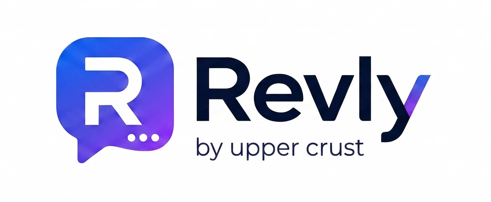

# Revly — AI-Powered Review & Reputation Management Platform

<p align="center">
  
</p>

<p align="center">
  <strong>Monitor. Analyze. Respond. Grow.</strong><br>
  An AI-powered online reputation management platform for multi-location restaurant brands.
</p>

---

## What is Revly?

Revly is a full-stack SaaS dashboard that aggregates customer reviews from **Google Business Profile, Zomato, Swiggy, and Reelo** into a single premium analytics dashboard. It helps marketing teams monitor sentiment, track NPS scores, respond to complaints with AI-generated replies, and compare performance across all restaurant outlets — all in one place.

---

## Key Features

### 📊 Unified Dashboard
- Real-time KPI cards (Average Rating, Reviews Collected, Negative Reviews, Response Rate)
- Sentiment trend charts (Overview, Sentiment, Complaints)
- Platform breakdown with per-platform ratings
- NPS Score gauge with promoter/detractor breakdown
- Ratings distribution (1–5 star horizontal bars)
- Complaints & Praises with AI insight cards and location-level progress bars

### 📍 Location Leaderboard
- Hero cards: Top Performer & Most Improved
- Toggle between Top Performing / Most Improved sorting
- Progress bars showing relative performance
- Pastel rating badges (blue, green, yellow, pink)
- Trend arrows with percentage change

### ⭐ Reviews Management
- Searchable, filterable review feed
- Sentiment badges (positive / negative / neutral)
- AI-powered reply generation (Professional, Friendly, Formal, Empathetic tones)
- Manual reply editor
- Reply approval workflow (Generate → Approve → Send)
- **Ask Revly** — AI chat for instant review insights

### 🔗 Platform Integration
- **6 Platforms:** Google Business, Zomato, Swiggy, Reelo, Magicpin, TripAdvisor
- OAuth / Email / Mobile authentication flow
- Account selection (multi-account support)
- Location-level connection (choose which outlets to sync)
- Auto-sync every 15 minutes
- Connection health monitoring
- Sync statistics (reviews, negative, pending, avg rating)
- Manage: Sync Now, Reconnect, Disconnect, Connect New Account

### 🤖 AI Features
- Auto-reply generation with tone selection
- Sentiment analysis on all reviews
- Topic extraction (food quality, pricing, service, ambience)
- AI insight cards in complaints/praises section
- Ask Revly chat for instant analytics questions

### 🎨 Premium Dark UI (Olly-Inspired)
- Dark navy background (#0F1835)
- Creamy white cards (#FFF9F1)
- Pastel accent colors for KPIs
- 24px border radius throughout
- Soft shadows and smooth transitions
- SVG semi-circle NPS gauge
- Floating Quick Nav button (⚡)

---

## Tech Stack

### Frontend
| Technology | Purpose |
|---|---|
| React 19 | UI library |
| TypeScript | Type safety |
| Vite | Build tool & dev server |
| Tailwind CSS | Utility-first styling |
| shadcn/ui | UI components |
| Framer Motion | Animations |
| TanStack Query | Server state |
| React Router 7 | Routing |
| Recharts | Charts & graphs |
| Zustand | Client state |
| Axios | HTTP client |
| Lucide React | Icons |

### Backend
| Technology | Purpose |
|---|---|
| FastAPI | REST API framework |
| SQLAlchemy 2 | ORM |
| Alembic | Database migrations |
| PyJWT + bcrypt | Authentication |
| PostgreSQL 16 | Production database |
| SQLite | Local development |
| Pydantic | Data validation |

### Infrastructure
| Technology | Purpose |
|---|---|
| Docker | Containerization |
| Nginx | Reverse proxy |
| Oracle Cloud Always Free | Hosting |
| PWA | Mobile app (installable) |

---

## Project Structure

```
Revly/
├── backend/
│   ├── app/
│   │   ├── api/v1/          # API routes (auth, dashboard, reviews, integrations, etc.)
│   │   ├── core/            # Config, database, constants
│   │   ├── models/          # SQLAlchemy models (User, Review, Location, Integration)
│   │   ├── schemas/         # Pydantic request/response schemas
│   │   └── seeds/           # Database seed data
│   ├── tests/               # Pytest integration tests
│   ├── seed_all.py          # Master seed script
│   └── Dockerfile
├── frontend/
│   ├── public/              # Static assets (logo, icons, manifest, service worker)
│   ├── src/
│   │   ├── app/routes/      # Page components (overview, reviews, leaderboard, account)
│   │   ├── components/
│   │   │   ├── dashboard/   # KPIs, charts, NPS, ratings, complaints/praises
│   │   │   ├── integrations/# Connect modal, manage platform, summary cards
│   │   │   ├── layout/      # Sidebar, header, date filter, location filter
│   │   │   ├── reviews/     # Review cards, detail, AI banner, reply editor
│   │   │   └── shared/      # Ask Revly, one-tap opener, loading spinner
│   │   ├── stores/          # Zustand stores (auth, filter, dashboard, etc.)
│   │   ├── types/           # TypeScript interfaces
│   │   └── lib/             # API client, utilities
│   └── Dockerfile
├── nginx/                   # Nginx config for production
├── docker-compose.yml
└── start.bat                # One-click local development startup
```

---

## Getting Started

### Prerequisites
- Node.js 18+
- Python 3.11+
- PostgreSQL (production) or SQLite (local)

### Quick Start (Local Development)

```bash
# Clone the repository
git clone https://github.com/Sushmitagupta1/Revly-an-social-media-review-and-reputation-managament-app.git
cd Revly-an-social-media-review-and-reputation-management-app

# One-click startup (Windows)
start.bat

# Or manual setup:

# Backend
cd backend
python -m venv venv
venv\Scripts\activate
pip install -r requirements.txt
python seed_all.py
uvicorn app.main:app --reload --port 8000

# Frontend (new terminal)
cd frontend
npm install
npm run dev
```

### Access
- **Frontend:** http://localhost:5173
- **Backend API:** http://localhost:8000
- **API Docs:** http://localhost:8000/docs

### Default Login
- **Email:** admin@uppercrust.com
- **Password:** password123

---

## Environment Variables

### Backend (`backend/.env`)
```env
DATABASE_URL=sqlite:///./revly.db
SECRET_KEY=your-secret-key
CORS_ORIGINS=http://localhost:5173
```

### Frontend (`frontend/.env`)
```env
VITE_API_URL=http://localhost:8000/api/v1
```

---

## API Endpoints

| Method | Endpoint | Description |
|---|---|---|
| POST | `/api/v1/auth/login` | Login with email/password |
| POST | `/api/v1/auth/register` | Register new account |
| GET | `/api/v1/auth/me` | Get current user |
| GET | `/api/v1/dashboard` | Dashboard data (supports `?locations=` filter) |
| GET | `/api/v1/reviews` | List reviews (filterable) |
| POST | `/api/v1/reviews/{id}/reply` | Generate AI reply |
| PATCH | `/api/v1/replies/{id}/approve` | Approve reply |
| POST | `/api/v1/replies/{id}/send` | Send reply |
| GET | `/api/v1/leaderboard` | Location rankings |
| GET | `/api/v1/locations` | List locations |
| POST | `/api/v1/locations` | Create location |
| GET | `/api/v1/integrations` | List platform integrations |
| POST | `/api/v1/integrations` | Connect new platform |
| PATCH | `/api/v1/integrations/{id}` | Toggle connection |
| DELETE | `/api/v1/integrations/{id}` | Remove integration |

---

## Deployment

### Docker
```bash
docker-compose up --build -d
```

### Manual (Oracle Cloud)
1. Provision Ubuntu VM (Always Free tier)
2. Install Docker, Nginx, PostgreSQL
3. Clone repo and build with Docker Compose
4. Configure Nginx reverse proxy with SSL (Let's Encrypt)
5. Point domain to VM public IP

---

## Screenshots

### Dashboard
Dark navy theme with creamy white cards, pastel KPI badges, SVG NPS gauge, and sentiment trend charts.

### Location Leaderboard
Hero cards for Top Performer & Most Improved, toggle sorting, progress bars with pastel rating badges.

### Platform Integration
6-platform connect flow with OAuth/Email/Mobile authentication, account selection, location picker, and sync management.

### Reviews
Searchable review feed with AI reply generation, tone selection, and Ask Revly chat.

---

## License

This project is proprietary software built for Upper Crust restaurant chain.

---

## Author

**Sushmita Gupta** — [GitHub](https://github.com/Sushmitagupta1)

---

<p align="center">
  Built with ❤️ for better customer experiences
</p>
